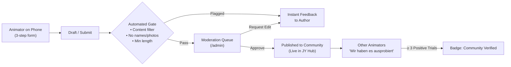

# JY Hub — Community Layer Technical Proposal (RFC)

**Target Audience:** Bahá'í Junior Youth Animators, Camp Coordinators, Institute Board Members  
**Goal:** Transform JY Hub into a community-powered library while preserving simplicity, canonical scripture integrity, and strict child safety.

---

## 1. Core Principles & Guardrails

1. **Child Safeguarding by Design (GDPR / Youth Protection):**
   - The platform is strictly for **adult animators and mentors (18+)**.
   - Under no circumstances will personal data, names, or identifiable photographs of junior youth be collected, submitted, or stored.
   - Submissions containing personal anecdotes with real names are rejected by moderation policy.

2. **Scripture Integrity:**
   - Canonical Bahá'í scripture quotations remain strictly curated and immutable. Community submissions apply exclusively to **games, memorisation methods, service projects, arts prompts, and field tips**.

3. **Curated vs. Community Badge Hierarchy:**
   - 🌟 **Kuratierte Kern-Ressource (Curated):** Tested core library directly aligned with Ruhi Book 5 materials.
   - ✅ **Erprobt in der Praxis (Community Verified):** Community contribution with ≥3 confirmed animator field reports ("Wir haben es ausprobiert").
   - 💡 **Neuer Impuls (Community New):** Reviewed and approved by moderators, ready for groups to test.

---

## 2. Recommended Tech Stack

| Layer | Technology | Rationale |
| :--- | :--- | :--- |
| **Auth** | Supabase Auth (Passwordless Magic Link + OTP) | Zero friction for animators on phones; no passwords to remember or leak; GDPR-compliant EU data center (Frankfurt). |
| **Database** | Supabase PostgreSQL + Row Level Security (RLS) | Declarative security policies; instant REST + GraphQL API; low maintenance; generous free tier. |
| **File Storage** | Cloudflare R2 / Supabase Storage | For diagrams, printable craft templates (PDF/SVG). Automatic EXIF metadata stripping. |
| **Offline Cache** | IndexedDB (TanStack Query + Dexie.js) | Full read availability in camps with zero cell coverage; syncs when back online. |

---

## 3. Data Schema & Relationships

### 3.1 `activities`
```sql
CREATE TABLE activities (
  id UUID PRIMARY KEY DEFAULT gen_random_uuid(),
  type VARCHAR(32) NOT NULL, -- 'game', 'quote_method', 'service', 'art'
  title_de TEXT NOT NULL,
  title_en TEXT NOT NULL,
  summary_de TEXT NOT NULL,
  summary_en TEXT NOT NULL,
  instructions_de TEXT NOT NULL,
  instructions_en TEXT NOT NULL,
  metadata JSONB NOT NULL DEFAULT '{}', -- energyLevel, minPlayers, maxPlayers, durationMinutes, materials
  status VARCHAR(24) NOT NULL DEFAULT 'pending', -- 'draft', 'pending', 'approved', 'rejected'
  submitted_by UUID REFERENCES auth.users(id),
  curated_by UUID REFERENCES auth.users(id),
  rejection_reason TEXT,
  created_at TIMESTAMPTZ DEFAULT NOW(),
  updated_at TIMESTAMPTZ DEFAULT NOW()
);
```

### 3.2 `activity_feedback` ("Wir haben es ausprobiert")
```sql
CREATE TABLE activity_feedback (
  id UUID PRIMARY KEY DEFAULT gen_random_uuid(),
  activity_id UUID REFERENCES activities(id) ON DELETE CASCADE,
  user_id UUID REFERENCES auth.users(id),
  rating SMALLINT CHECK (rating >= 1 AND rating <= 5),
  group_size INT,
  age_range VARCHAR(16), -- '11-12', '13-14', '11-15'
  practical_tip TEXT, -- e.g. "Take 5 extra minutes for explanation"
  energy_outcome VARCHAR(24), -- 'calm', 'energized', 'focused'
  created_at TIMESTAMPTZ DEFAULT NOW()
);
```

### 3.3 `collections` (Shared Playlists / Camp Packs)
```sql
CREATE TABLE collections (
  id UUID PRIMARY KEY DEFAULT gen_random_uuid(),
  title TEXT NOT NULL,
  description TEXT,
  is_public BOOLEAN DEFAULT FALSE,
  user_id UUID REFERENCES auth.users(id),
  items JSONB NOT NULL DEFAULT '[]', -- array of { type, id, order }
  created_at TIMESTAMPTZ DEFAULT NOW()
);
```

### 3.4 `translation_requests` (DE ⇄ EN Parity)
```sql
CREATE TABLE translation_requests (
  id UUID PRIMARY KEY DEFAULT gen_random_uuid(),
  activity_id UUID REFERENCES activities(id) ON DELETE CASCADE,
  source_lang VARCHAR(2) NOT NULL,
  target_lang VARCHAR(2) NOT NULL,
  status VARCHAR(24) DEFAULT 'open', -- 'open', 'in_progress', 'review', 'completed'
  assigned_to UUID REFERENCES auth.users(id),
  translated_content JSONB
);
```

---

## 4. Submission & Moderation Workflow



### Moderation Roles
- **Animator:** Can sign in via magic link, submit activities, bookmark, rate activities with practical tips, and build shared camp collections.
- **Moderator (Appointed Animators / Coordinators):** Review queue in `/admin`. Can approve, suggest edits, or reject submissions with a helpful message.

---

## 5. Offline & Hybrid Architecture

1. **Static Baseline:** Core items (the current 29 games, 51 quotes, 50 methods) remain bundled as static code for instant 0ms first-load.
2. **Incremental Dynamic Layer:** When connected, JY Hub queries the Supabase API via TanStack Query and caches newly approved community resources in IndexedDB.
3. **Optimistic Offline Actions:** If an animator at camp marks an activity as "Tried it" with a note, it is stored in IndexedDB and synchronized as soon as network connectivity is restored.

---

## 6. Implementation Phasing

- **Phase 1 (Auth & Bookmarks):** Magic link sign-in, cloud sync of bookmarks and session plans across phone and tablet.
- **Phase 2 (Community Submissions):** Multi-step submission wizard, moderation dashboard.
- **Phase 3 (Field Feedback & Collections):** "Wir haben es ausprobiert" rating form, camp packs sharing via unique URL.
- **Phase 4 (Bilingual Crowdsourcing):** Translation helper UI for animators to translate community activities between German and English.
